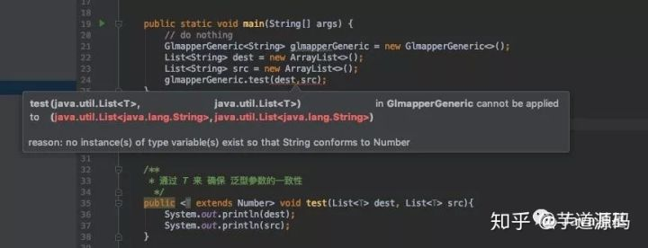
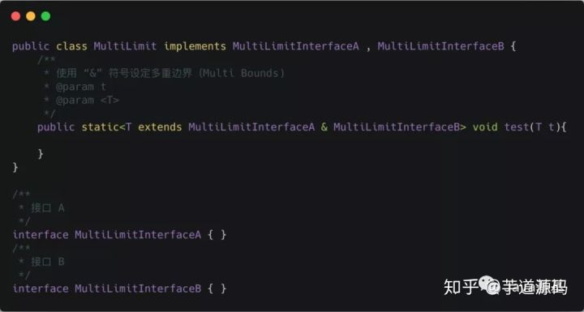
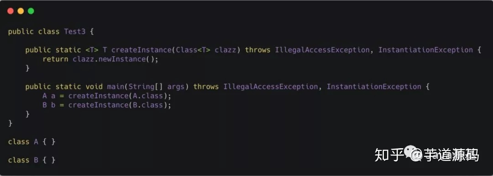

# Java 泛型

### 常用的T, E, K, V, ?

```
? 表示不确定的 java 类型
T (type) 表示具体的一个java类型
K V (key value) 分别代表java键值中的Key Value
E (element) 代表Element
```


### 上界通配符 < ? extends E>

> 上届：用 extends 关键字声明，表示参数化的类型可能是所指定的类型，或者是此类型的子类。


### 下界通配符 < ? super E>

> 下界: 用 super 进行声明，表示参数化的类型可能是所指定的类型，或者是此类型的父类型，直至 Object


### ? 和 T 的区别

> ？和 T 都表示不确定的类型，区别在于我们可以对 T 进行操作，但是对 ？不行
>
> T 是一个 确定的 类型，通常用于泛型类和泛型方法的定义，？是一个 不确定 的类型，通常用于泛型方法的调用代码和形参，不能用于定义类和泛型方法。

1 通过T来确保泛型参数一致性




2 类型参数可以多重限定面通配符不行



3 通配符可以使用超类限定而类型参数不行

> T extends A

> ? extends A
>
> ? super A


### Class < T > 和 Class< ? > 区别

> `Class<T>`在实例化的时候，T 要替换成具体类。`Class<?>`它是个通配泛型，? 可以代表任何类型，所以主要用于声明时的限制情况。




