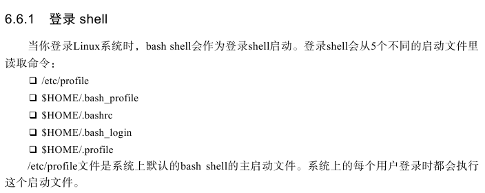
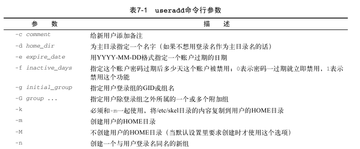
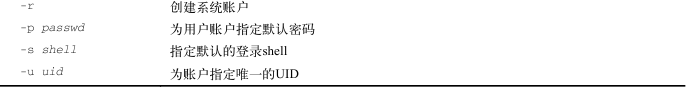
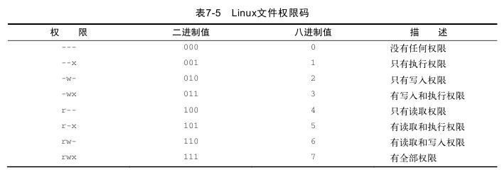
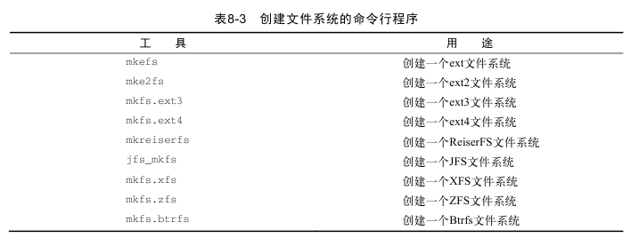
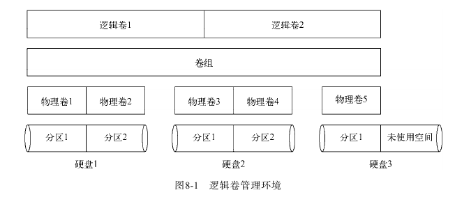
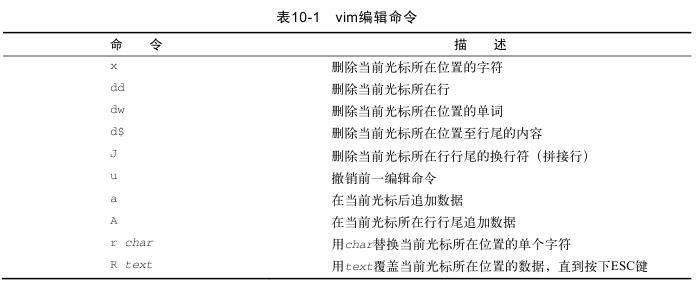

# Linux 命令行

#### 监测程序

##### **ps**

ps -ef 显示所有进程

```bash
$ ps -ef
UID        PID  PPID  C STIME TTY          TIME CMD
root         1     0  0 11:51 ?        00:00:00 /init
root        10     1  0 11:51 tty1     00:00:00 /init
xuan        11    10  0 11:51 tty1     00:00:00 -bash
xuan       271    11  0 14:32 tty1     00:00:00 ps -ef
```


ps -l

```bash
$ ps -l
F S   UID   PID  PPID  C PRI  NI ADDR SZ WCHAN  TTY          TIME CMD
0 S  1000    11    10  0  80   0 -  4231 -      tty1     00:00:00 bash
0 R  1000   272    11  0  80   0 -  4271 -      tty1     00:00:00 ps
```


##### top

```bash
$ top
top - 14:43:28 up  2:51,  0 users,  load average: 0.52, 0.58, 0.59
Tasks:   4 total,   1 running,   3 sleeping,   0 stopped,   0 zombie
%Cpu(s):  2.7 us,  1.8 sy,  0.0 ni, 95.0 id,  0.0 wa,  0.5 hi,  0.0 si,  0.0 st
KiB Mem :  8293160 total,  2692552 free,  5371256 used,   229352 buff/cache
KiB Swap: 25165824 total, 24642664 free,   523160 used.  2788172 avail Mem

  PID USER      PR  NI    VIRT    RES    SHR S  %CPU %MEM     TIME+ COMMAND
  274 xuan      20   0   17620   2044   1508 R   0.3  0.0   0:00.19 top
    1 root      20   0    8936    312    268 S   0.0  0.0   0:00.07 init
   10 root      20   0    8944    228    180 S   0.0  0.0   0:00.00 init
   11 xuan      20   0   16924   3644   3544 S   0.0  0.0   0:00.67 bash
```

> 一般平均负载load average 超过2，说明系统比较繁忙


f 排序

d 修改轮询间隔

##### kill

kill 3940

kill -s HUP 3940

##### killall

killall http*


#### 监测磁盘空间

##### mount

mount -t type device directory

##### umount

umount [directory | deivce]

##### df

df -h

##### du

du -sh

#### 处理数据文件

##### sort

sort -n file 

sort -t ':' -k 3 -n /etc/passwd

> du -sh * | sort -nr

##### grep

grep [options] pattern [file]

-v 反向

-n 显示行号

-c 匹配行数

grep [tf] 正则

##### tar

tar -cvf test.tar test/ test2/

tar -tf test.tar 只列出不提取

tar -xvf test.tar 提取

-z 重定向到gzip

#### Shell 

##### jobs -l 后台进程

##### coproc { sleep 10; } 协程-》子shell, 同时进入后台模式

### 环境变量

##### printenv

printenv HOME

echo $HOME

##### set 全局、局部、用户定义变量

##### 设置局部变量 

```bash
$home=/home/xuan
```


##### 设置全局环境变量

```bash
$my_global=global
$export my_global
```

##### 删除环境变量

unset my_global

##### 设置PATH环境变量

```bash
$PATH=$PATH:/xuan
```

只能持续到退出或重启系统



##### 环境变量持久化

如果设置在/etc/profile, 系统升级即消失；

最好在/etc/profile.d目录中创建一个以.sh结尾的文件。

存储个人用户变量： $HOME/.bashrc


### 文件权限

#### 用户

/etc/passwd

```
root:x:0:0:root:/root:/bin/bash
```


普通用户的UID大多从500开始

实际密码在/etc/shadow

##### 添加新用户

useradd

useradd -D

```bash
~$ useradd -D
GROUP=100
HOME=/home
INACTIVE=-1
EXPIRE=
SHELL=/bin/sh
SKEL=/etc/skel
CREATE_MAIL_SPOOL=no
```

useradd -m test 会创建/home/test目录，并将/etc/skel目录中文件复制过来





##### 删除用户

###### userdel

userdel -r test 会删除/home/test

##### 修改用户

###### usermod

###### passwd和chpasswd

passwd test 修改自己密码

chsh\chfn\chage 

#### 组

/etc/group 

```bash
root:x:0:
```


##### 创建组

###### groupadd

groupadd shared

usermod -G shared test

##### 修改组

###### groupmod

groupmod -n sharing shared

#### 文件权限

```
drwxrwxrwx
-rw-rw-rw-
```


> r:可读；w: 可写；x: 可执行

##### 默认文件权限

umask

0022

可修改默认值 umask 026



> 文件全限值为666，目录为777。减去022，即为默认权限644，755

##### 改变权限

chmod options mod file

```
chmod 760 newfile
```

chmod [ugoa...] [+-=] [rwxXstugo...]


```
chmod o+r newfile
chmod u-x newfile
```


##### 补充

chown 更改user

chgrp  更改group


### 文件系统

文件系统通过 `索引节点号` 而不是文件全名及路径来标识文件。

#### 日志文件系统

##### ext4

Ubuntu默认

支持数据压缩和加密；

extent按块分配空间，在索引节点表中只保存起始块的位置

块预分配技术

##### Reiser

只把索引节点表数据写到日志文件

尾部压缩：可以在线调整文件系统大小

##### JFS

有序日志

IBM Linux

##### XFS

#### 写时复制文件系统

回写模式：性能好，安全性不能保证

copy-on-write: 快照。旧数据不会被重写，写入另一个位置

##### ZFS

用于OpenSolaris

##### Btrfs

B树

#### 操作

##### 创建分区

###### fdisk

```
fdisk /dev/sdb
```

##### 创建文件系统



```bash
sudo mount -t ext4 /dev/sdb1 /mnt/my_partition
```

该方法仅能临时挂载。若要在启动时挂载，可以将其添加到/etc/fstab

##### 检测与修复

###### fsck

能够检查和修复大部分的Linux文件系统

#### 逻辑卷管理

logical volumn manager, LVM

动态添加存储空间




### 包管理

dpkg: 基于Debian发行版

rpm: 基于RedHat

```
dpkg -L package_name:列出软件包所安装的全部文件
dpkg --search absolute_file_name: 反向查找特定文件属于哪个包
```

仓库位置: /etc/apt/sources.list


### Vim

普通模式




命令行模式：冒号


##### 复制和粘贴

```
yw 复制一个字
y$ 复制到行尾
p 粘贴
```

可视模式

光标移到复制开始位置，按v，移动光标选择，按y 复制，按p粘贴


## 网络相关

### ifconfig 查看和配置网络设备

```bash
ifconfig  [网络设备] [参数] # 查看和配置网络设备
up # 启动指定网络设备/网卡。
down # 关闭指定网络设备/网卡。该参数可以有效地阻止通过指定接口的IP信息流，如果想永久地关闭一个接口，我们还需要从核心路由表中将该接口的路由信息全部删除。
arp # 设置指定网卡是否支持ARP协议。
-promisc # 设置是否支持网卡的promiscuous模式，如果选择此参数，网卡将接收网络中发给它所有的数据包
-allmulti # 设置是否支持多播模式，如果选择此参数，网卡将接收网络中所有的多播数据包
-a # 显示全部接口信息
-s # 显示摘要信息（类似于 netstat -i）
add # 给指定网卡配置IPv6地址
del # 删除指定网卡的IPv6地址
<硬件地址> # 配置网卡最大的传输单元
mtu<字节数> # 设置网卡的最大传输单元 (bytes)
netmask<子网掩码> # 设置网卡的子网掩码。掩码可以是有前缀0x的32位十六进制数，也可以是用点分开的4个十进制数。如果不打算将网络分成子网，可以不管这一选项；如果要使用子网，那么请记住，网络中每一个系统必须有相同子网掩码。
tunel # 建立隧道
dstaddr # 设定一个远端地址，建立点对点通信
-broadcast<地址> # 为指定网卡设置广播协议
-pointtopoint<地址> # 为网卡设置点对点通讯协议
multicast # 为网卡设置组播标志
address # 为网卡设置IPv4地址
txqueuelen<长度> # 为网卡设置传输列队的长度
```

```
使用范例：
ifconfig ==>显示系统中所有网卡信息
ifconfig eth0 up ==>启动网卡eth0
ifconfig eth0 down ==>关闭网卡eth0
ifconfig eth0:0 10.0.0.8 netmask 255.255.255.0 up ==>为网卡配置别名ip
```


### route 显示和操作IP路由表

```bash
route [-f] [-p] [Command [Destination] [mask Netmask] [Gateway] [metric Metric]] [if Interface]

# Route命令是用于操作基于内核ip路由表，它的主要作用是创建一个静态路由让指定一个主机或者一个网络通过一个网络接口，如eth0。当使用"add"或者"del"参数时，路由表被修改，如果没有参数，则显示路由表当前的内容。

-c # 显示更多信息
-n # 不解析名字
-v # 显示详细的处理信息
-F # 显示发送信息
-C # 显示路由缓存
-f # 清除所有网关入口的路由表。
-p # 与 add 命令一起使用时使路由具有永久性。
add # 添加一条新路由。
del # 删除一条路由。
-net # 目标地址是一个网络。
-host # 目标地址是一个主机。
netmask # 当添加一个网络路由时，需要使用网络掩码。
gw # 路由数据包通过网关。注意，你指定的网关必须能够达到。
metric # 设置路由跳数。
Command # 指定您想运行的命令 (Add/Change/Delete/Print)。
Destination # 指定该路由的网络目标。
mask Netmask # 指定与网络目标相关的网络掩码（也被称作子网掩码）。
Gateway # 指定网络目标定义的地址集和子网掩码可以到达的前进或下一跃点 IP 地址。
metric Metric  # 为路由指定一个整数成本值标（从 1 至 9999），当在路由表(与转发的数据包目标地址最匹配)的多个路由中进行选择时可以使用。

if Interface # 为可以访问目标的接口指定接口索引。若要获得一个接口列表和它们相应的接口索引，使用 route print 命令的显示功能。可以使用十进制或十六进制值进行接口索引。
```

```
使用范例：
route del default ==>删除网关方法1
route add default gw 10.0.0.2 ==>添加网关方法1
route del default gw 10.0.0.2 ==>删除网关方法2
route add default gw 10.0.0.2 dev eth0 ==>添加网关方法2，使用dev指明网络设备，适用于多快网络设备的主机
配置网络路由（去往某一网络或网段的路由）
route add -net 192.168.1.0/24 gw 10.0.0.254
route add -net 192.168.1.0 netmask 255.255.255.0 dev eth0
route add -net 192.168.1.0/24 dev eth0
route del -net 192.168.1.0/24 dev eth0 ==>删除网络路由
#以上配置重启网络后会失效如果希望永久生效，则有如下几种方法
方法1：
vim /etc/sysconfig/netwoark-scripts/route-eth0 ==>默认不存在此文件
加入内容：
192.168.1.0/24 via 10.0.0.254
方法2：
vim /etc/sysconfig/static-routes ==>默认不存在此文件
加入内容：
any net 192.168.1.0/24 gw 10.0.0.254
方法3：
vim /etc/rc.local
加入内容：
route add -net 192.168.1.0/24 gw 10.0.0.254


```

> 静态路由
> Redhat是放在/etc/sysconfig/network-scripts；而Debian系的网卡配置则是存在/etc/network/interfaces这个文件里面

### ping 测试与目标主机的连通性

```bash
ping [参数] [主机名或IP地址]


-d # 使用Socket的SO_DEBUG功能。
-f # 极限检测。大量且快速地送网络封包给一台机器，看它的回应。
-n # 只输出数值。
-q # 不显示任何传送封包的信息，只显示最后的结果。
-r # 忽略普通的Routing Table，直接将数据包送到远端主机上。通常是查看本机的网络接口是否有问题。
-R # 记录路由过程。
-v # 详细显示指令的执行过程。
<p>-c 数目 # 在发送指定数目的包后停止。
-i 秒数 # 设定间隔几秒送一个网络封包给一台机器，预设值是一秒送一次。
-I 网络界面 # 使用指定的网络界面送出数据包。
-l 前置载入 # 设置在送出要求信息之前，先行发出的数据包。
-p 范本样式 # 设置填满数据包的范本样式。
-s 字节数 # 指定发送的数据字节数，预设值是56，加上8字节的ICMP头，一共是64ICMP数据字节。
-t 存活数值 # 设置存活数值TTL的大小。
```

## 88. netstat 显示与IP、TCP、UDP和ICMP协议相关的统计数据

```bash
netstat [-acCeFghilMnNoprstuvVwx][-A<网络类型>][--ip]

netstat用于显示与IP、TCP、UDP和ICMP协议相关的统计数据，一般用于检验本机各端口的网络连接情况。

-a或–all # 显示所有连线中的Socket。
-A<网络类型>或–<网络类型>  # 列出该网络类型连线中的相关地址。
-c或–continuous # 持续列出网络状态。
-C或–cache # 显示路由器配置的快取信息。
-e或–extend  # 显示网络其他相关信息。
-F或–fib # 显示FIB。
-g或–groups # 显示多重广播功能群组组员名单。
-h或–help # 在线帮助。
-i或–interfaces # 显示网络界面信息表单。
-l或–listening # 显示监控中的服务器的Socket。
-M或–masquerade # 显示伪装的网络连线。
-n或–numeric # 直接使用IP地址，而不通过域名服务器。
-N或–netlink或–symbolic # 显示网络硬件外围设备的符号连接名称。
-o或–timers # 显示计时器。
-p或–programs # 显示正在使用Socket的程序识别码和程序名称。
-r或–route # 显示Routing Table。
-s或–statistice # 显示网络工作信息统计表。
-t或–tcp # 显示TCP传输协议的连线状况。
-u或–udp # 显示UDP传输协议的连线状况。
-v或–verbose # 显示指令执行过程。
-V或–version # 显示版本信息。
-w或–raw  # 显示RAW传输协议的连线状况。
-x或–unix # 此参数的效果和指定”-A unix”参数相同。
–ip或–inet # 此参数的效果和指定”-A inet”参数相同。
```