# Network

### 一、基础知识

#### 1 OSI model

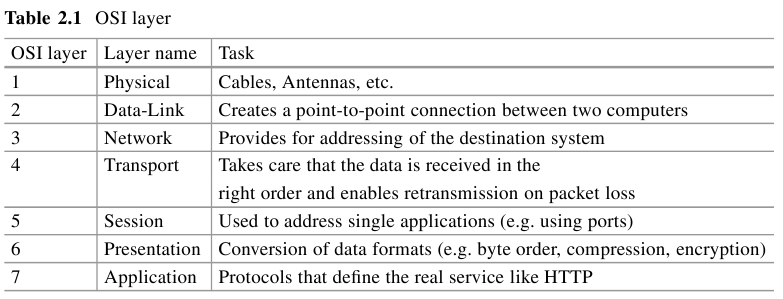


#### 2 Ethernet

- twised pare cables: STP(lower quality) / UTP
- patch and cross cables
- network card: MAC address
  - 修改MAC: ifconfig eth0 hw ether c0:df:de:ad:be:ef 
- CSMA/CD: 防碰撞

#### 3 VLAN

logical

802.1q header: tagging of packets

#### 4 ARP

Address Resolution Protocol

ARP and RARP


#### 5 IP v4

> connection-less protocol

handles fragmentation by cutting packets bigger than MTU(Max Transmission Unit) into smaller ones

TTL to avoids endless network loops


netmask( like 255.255.255.0) net-start-address

broadcast address to every host on the network

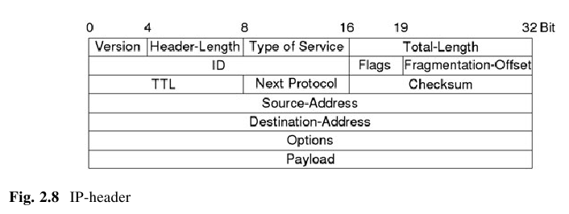

#### 6 ICMP

ping

TTL

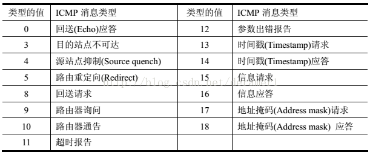

#### 7 TCP

Transmission Control Protocol

Initialized by Three-Way-Handshake

ensure all packets in the same order

destination host sends an acknowledgment to let source know that the packet was recieved correctly

source port / destination port

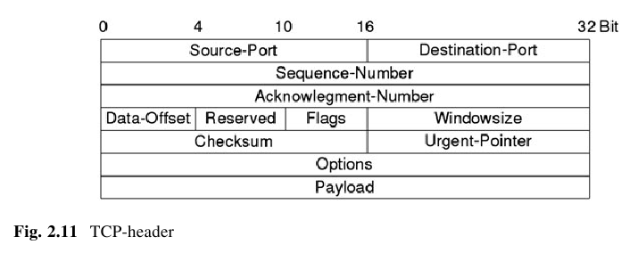

tcp flags , sequence and acknowledgment-number, windowsize

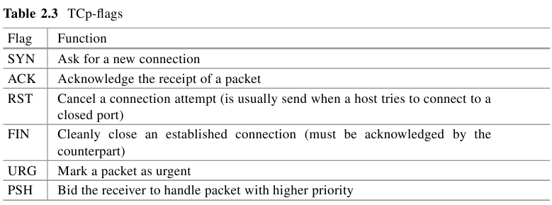

SYN-Flag random number

#### 8 UDP

not care about packet loss or order 

fire and forget

used for streaming services / DNS

#### 9 Gateway

default gateway

routing table

LAN

#### 10 Router

internet routers by ISP and home router to connect LAN

RIP,OSPF and BGP to share routing information and find shortest or quickest way

traceroute

#### 11 Proxies

like a router

web proxy/ transparent proxy

#### 12 VPN

Virtual Private Networks

security mechanism

the deeper, the more secure

 IPsec, PPTP and OpenVPN

#### 13 Firewalls

packet filter：on layer 3 and 4

intrusion detection systems: HIDS/NIDS

intrusion prevention system

honeypot: prealert and log


### 二、Python

#### 1 modules

operating and file system: sys, os

http and web access: urllib, urllib2, httplib, htmllib, cookielib

ftp: ftplib

telnet: telnetlib

smtp: smtplib

> `__init__.py` signalizes Python that this directory should be treated as a package

#### 2 Regular Expressions

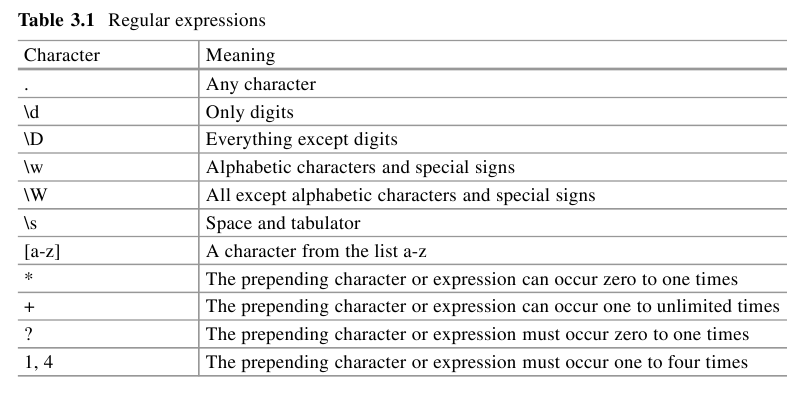

### 三、Layer2 attacts

#### 1 ARP-Cache-Poisoning

#### 2 MAC-Flooder

#### 3 VLAN-Hopping

#### 4 DTP Abusing


### 四、TCP/IP Tricks

#### 1 IP-Spoofing

#### 2 SYN-Flooder

#### 3 Port-Scanning

#### 4 ICMP-Redirection

#### 5 RST Daemon


### 五、WHOIS DNS

Domain Name System resolves IP addresses via PTR records.

Computers use a DNS caching mechanism to save the resolved hostnames and only send a new request if the old IP is no longer reachable.


#### 1 Protocol

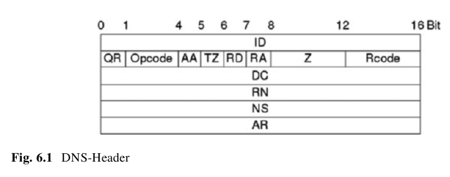

ID: client

QR: query(0) or response(1)

OP code: type of request. forward(0) and reverse lookup(1)

R code : reponse status. 0 success 1 fail 2 server error

AA: authorized(1)

TZ: truncated or not

RD: recursion desired. RA: answer 0  not available on requested server

#### 2 DNS record types

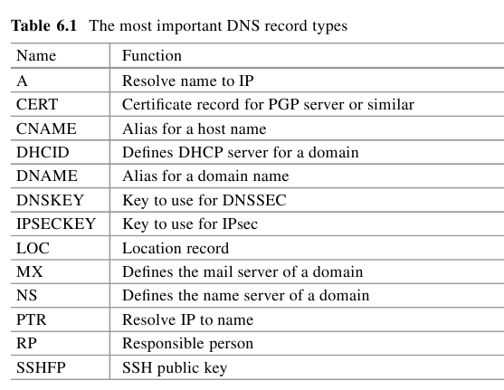

```bash
$host -t MX qiye.163.com
qiye.163.com mail is handled by 50 qiye163mx02.mxmail.netease.com.
qiye.163.com mail is handled by 10 qiye163mx01.mxmail.netease.com.
```


#### 3 WHOIS

whois baidu.com

#### 4 DNS Dictionary Mapper

to collect hostnames of a domain

**socket.gethostbyname**

#### 5 Reverse DNS Scanner

socket.gethostbyaddr

#### 6 DNS-Spoofing

UDP packets from or to port 53


### 六、HTTP Hacks

Hyper Text Transfer Protocol

#### 1 Protocol

stateless

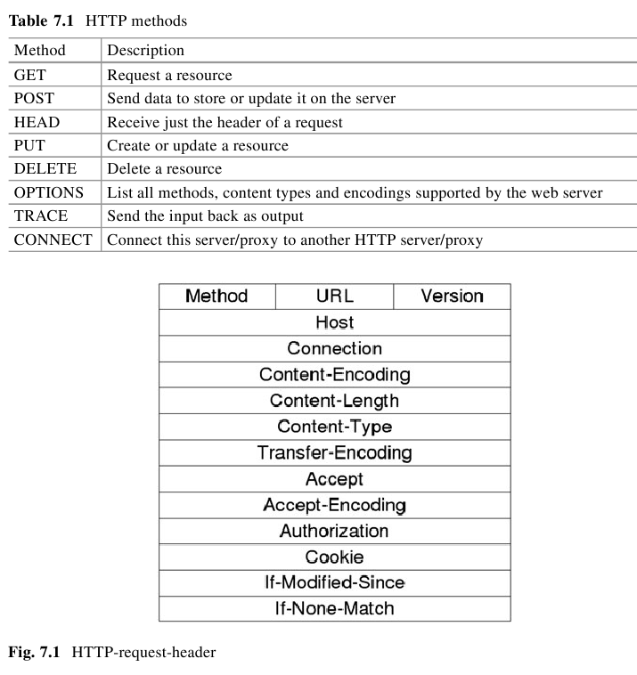

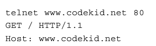

> HTTP 1.1 requests are required to have a **host header**.

Connection: not close after this one

Cookies: name/value pairs that the server asks the client to save and resend with every request.

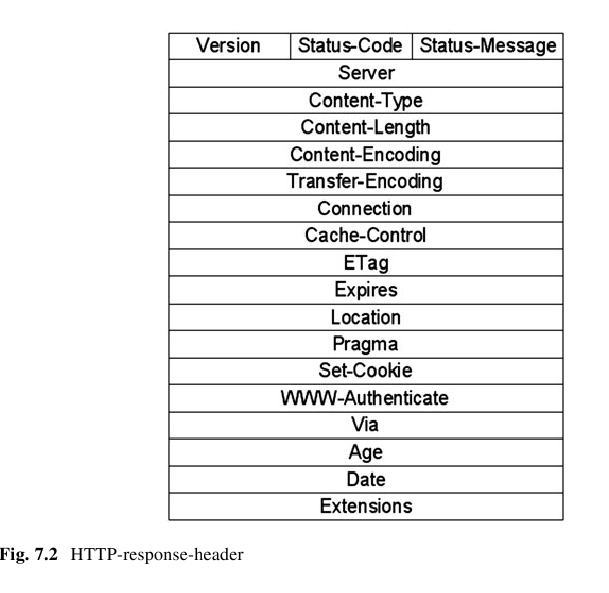

HTTP status codes: begins with 

1: server asks for next request being different

2: successful and free of any errors

3: successful but redirected request

4: failure

5: serious failure

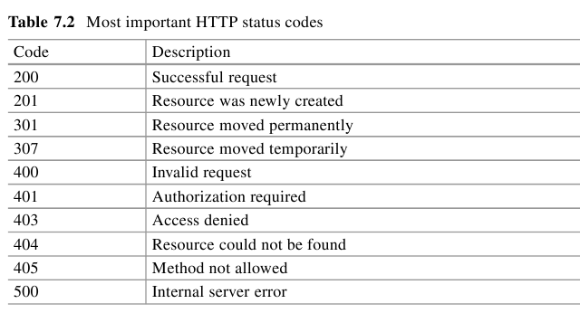

#### 2 Referer Spoofing

use it as a security feature to figure out if the request comes from an internal network

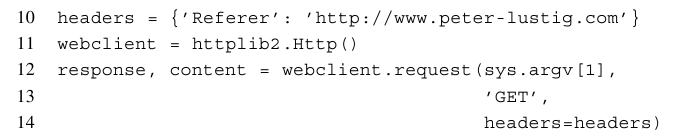

#### 3 Manipulation of Cookies

session ID: to identify a client

SQL or command injection

#### 4 HTTP-Auth Sniffing

Authorization: Basic

#### 5 Webserver Scanning


#### 6 SQL injection

- Open sesame

```
username=" OR ""=""
password=" OR ""=""
```


#### 7 SSL Sniffing

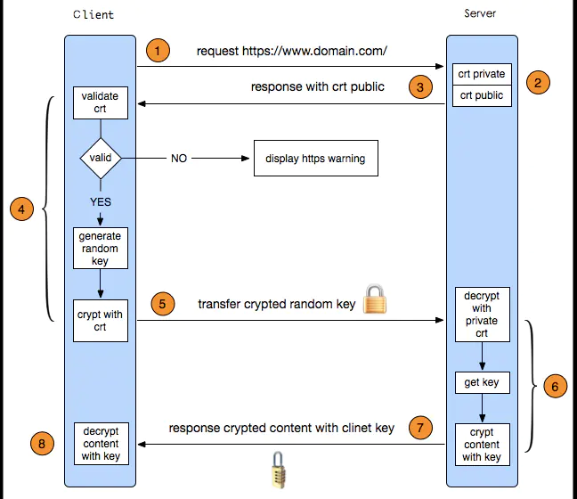

client: 对称加密 session key

server: 非对称加密 server certificate

### 七、 WiFi

#### 1 Protocol

infrastructure mode : AP

monitor mode : as Ethernet cards in Promisc mode

beacon: includes information about the network

> Probe requests: client asks for network it wants to establish a connection

- authentication
- association request
- EAP handshake

820.11 : 

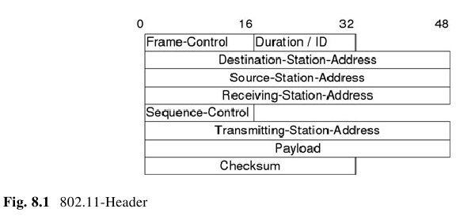

Frame-control Header: type and subtype of a packet

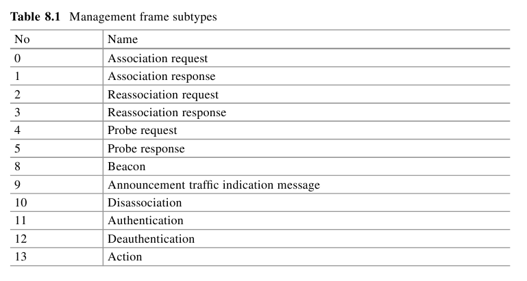