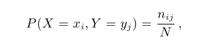
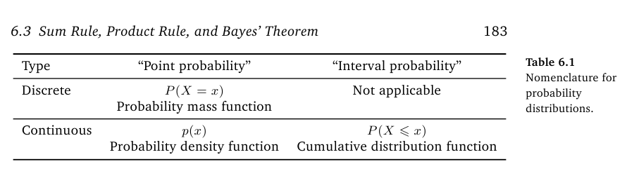
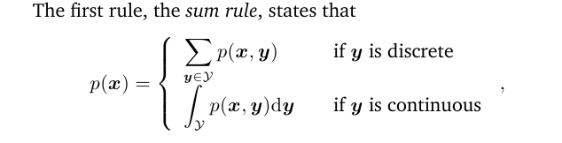
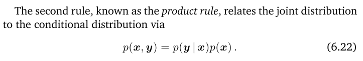
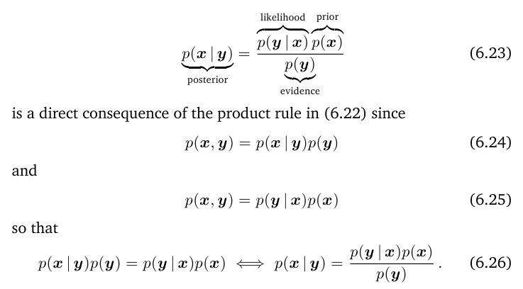

# Probability and Distributions

> **Probability distributions**: a function that measures the probability that a particular outcome will occur

### Probability space

**The Sample space**

all possible outcomes of the experiment

**The even space**

subset of the sample space

**The probability P**

P(A) measures the probability or degree of belief that the event will occur.

### Discrete Probabilities

Joint probability

conditional probability

p(y|x)

### Continuous Probabilities

### Sum Rule

### Product rule

### Bayes' theorem

