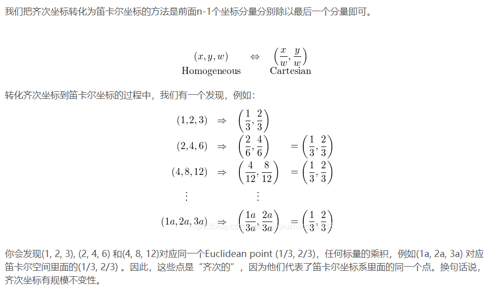
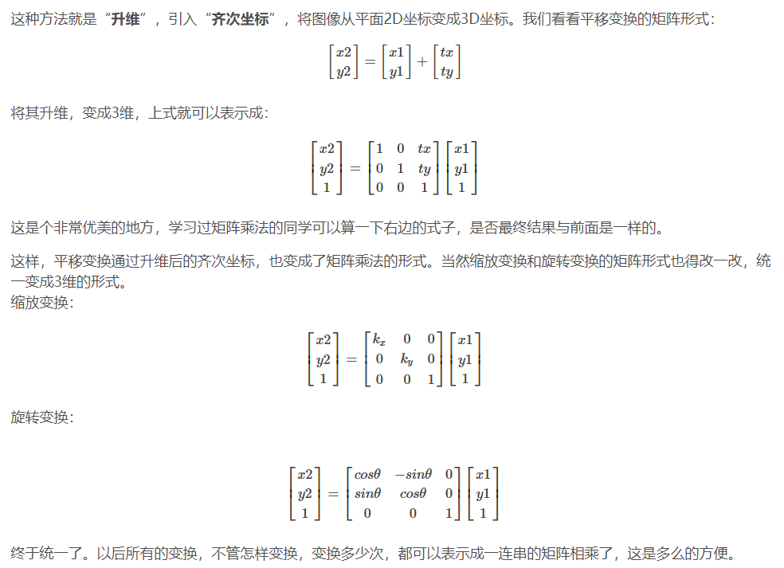

# 相机

### 标定

目的：**建立相机成像几何模型并矫正透镜畸变**

**建立相机成像几何模型**：计算机视觉的首要任务就是要通过拍摄到的图像信息获取到物体在真实三维世界里相对应的信息，于是，建立物体从三维世界映射到相机成像平面这一过程中的几何模型就显得尤为重要，而这一过程最关键的部分就是要得到相机的**内参和外参**

**矫正透镜畸变**：我们最开始接触到的成像方面的知识应该是有关小孔成像的，但是由于这种成像方式只有小孔部分能透过光线就会导致物体的成像亮度很低，于是聪明的人类发明了透镜。虽然亮度问题解决了，但是新的问题又来了：由于透镜的制造工艺，会使成像产生多种形式的畸变，于是为了去除畸变（使成像后的图像与真实世界的景象保持一致），人们计算并利用**畸变系数**来矫正这种像差。虽然理论上可以设计出不产生畸变的透镜，但其制造工艺相对于球面透镜会复杂很多，所以相对于复杂且高成本的制造工艺，人们更喜欢用数学来解决问题。

### 齐次坐标

齐次坐标就是用N+1维来代表N维坐标

> **齐次坐标的意义**：齐次坐标可以表示无穷远处的点

许多图形应用涉及到几何变换，主要包括平移、旋转、缩放。以矩阵表达式来计算这些变换时，平移是矩阵相加，旋转和缩放则是矩阵相乘，综合起来可以表示为 x=R∗X+t（注：因为习惯的原因，实际使用时一般使用变化矩阵左乘向量）(R 旋转缩放矩阵，t 为平移矩阵，X为原向量，x 为变换后的向量)。引入齐次坐标的目的主要是合并矩阵运算中的乘法和加法，表示为 x=P∗X的形式。即它提供了用矩阵运算把二维、三维甚至高维空间中的一个点集从一个坐标系变换到另一个坐标系的有效方法。

换句话说，**齐次坐标的作用**，**是把各种变换都统一了起来，即 把缩放，旋转，平移等变换都统一起来**，都表示成一连串的矩阵相乘的形式。保证了形式上的线性一致性。

