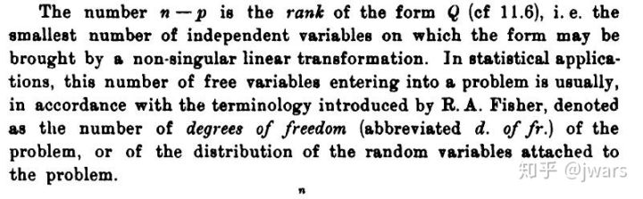
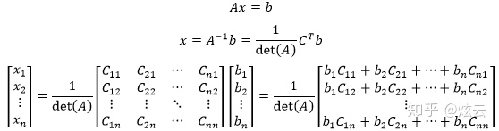
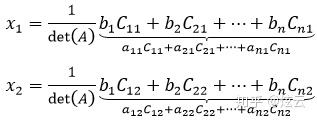
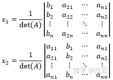
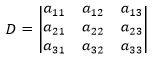
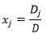
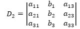

# 线性代数的理解

受《理解线性代数》启发，结合自身学习的经验，直观的总结我对线性代数的理解。强调直观是因为在这里不纠缠于数学的严谨性，所以如果追求数学严谨性和证明的还是去看教材比较好。

统计的目标是对数表内各种数据进行挖掘从而找出隐含其中的关系，线性代数为统计提供了对数表的表达方式和对数表进行处理的工具。

在初等数学中我们学过函数，用来表示的数据之间一种确定的关系，给定x一定能算出唯一的y。但现实中我们遇到的数据可就没有那么明确的联系了，我们不知道谁和谁有联系，甚至不知道是不是存在联系。因此我们急需一种框架来帮助我们处理这些”不好看”的数据。统计就是为了处理数据而生的，它的目标即挖掘出数据之间的联系，从而抽象出数学模型来做解释或预测。

先来扯句题外话，我们知道数学的本质是抽象。那究竟什么是抽象？抽象就是从不同个体中找相同，这些相同也就是规律和关系。初等数学中学到的函数关系就是一种规律，无论x到底是什么值，它和y之间都存在这样的规律。这也是为什么说数学模型都是错的，但却是有用的原因。抽象忽略了个体差异，只留相同点，利用相同点我们能处理满足此相同点的任何差异个体。

言归正传。回忆下中学解析几何或者大学微积分时我们是如何处理数据的: 我们会把函数f(x)映射到欧几里得空间内笛卡尔坐标系做visualization。在代数上对函数的操作等价于对欧几里得空间中相应函数图像做操作。函数是确定的关系，欧式空间也只能处理三维的问题，那有没有办法把任意的数表映射到空间呢？线性代数给我们提供了解决方案，它可以把任意数表映射到线性空间。那究竟什么是空间？从而使得我们可以对数表解析几何把初等代数和欧几里得空间联系起来，线性代数把方程组和线性空间结合起来。我们生活在欧几里得几何空间，关于这个空间的一些公理和常见几何物体以及对那些几何物体的操作我们在初等数学时都学过。从中我们能看到空间的基本组成。简单来说空间即是一个集合，这个集合定义了空间的基本组成元素（如 点）与基于元素之间关系（因此需要坐标系和点相对坐标系的位置坐标，在欧几里得空间里一般定义唯一的笛卡尔坐标系）以及（用点描述出来的）空间上物体的运动。线性空间中基本元素是向量，坐标系由线性无关的向量组组成，且在线性空间上的物体也由向量组表示，更神的是向量组本身又可以描述物体的运动。什么是向量？说白了就是一列数。向量组也就是矩阵，本质就是个数表。和我们把(x, y)值映射到笛卡尔二维坐标系的一个点一样，我们可以把一个长度为n的数列映射到n维的空间的一个点，而且我们可以人为的认为它是有方向的，即从原点指向数列所在位置点。总体来说，线性空间和欧几里得空间相通，不过我们所关注的不再现实生活中存在的几何体和它们具体长啥样，而是任意的数据。我们在线性空间上研究的物体不再像初等数学中研究的几何物体那么美，而是奇形怪状。线性代数处理对象更加general，关注的是数据本身。而且相比欧几里得空间里的绝对性(对笛卡尔坐标系), 线性空间强调的是相对性，不再局限the one axis， 只要是线性无关的向量就可以作为坐标系，也就是一组基。或许你会问了，初等数学时”画图”是为了方便我们理解来做题，对于n维的我们根本画不出来为什么还要映射到空间? 这里就牵扯到思维的转换了，高等数学更加强调抽象。在初等数学中任何代数操作都可以反映到欧氏空间，如坐标轴笛卡尔坐标系，也就是说任何代数操作实际上都有一个相应的空间操作对应。那么我们为何不能把这个基本思想推广到n维呢？我们既然能画出二维三维的，理论上也能”画”出n维的。对一个n维的数据进行代数操作同样也会有对应的n维空间上的操作。所以这里引入的空间并不是为了方便我们人类做题，而是一种严格的大一统数学框架。

当我们把数表抽象成一个矩阵个体，那么我们就可以定义出以矩阵为单位的运算。和对单个数类似，对矩阵也有加减乘，也有相应的运算率。加减必须基于同型矩阵，因为对于两张数表我们不能随意跳出两项就相加减吧？必须苹果加苹果，梨加梨对吧。也就是必须要相对应的项才能加减。乘法分成两个，数乘和矩阵相乘。数乘是某个数（标量）乘到矩阵每个元素之上，可以表示成kAkA. 对应到现实中类似于单位换算，如一张以kg为单位的表统一换算成lbs。矩阵相乘是最重要也是最特殊的一种运算。在之前说过不但线性空间被操作的对象是矩阵，矩阵的运动也是用矩阵表示。在深入谈之前我们先说矩阵乘法引入的原因。矩阵最常用也是最基础的应用是解方程组。我们初中时就学过，我们可以对方程组内每个方程左右同乘以某个数，把方程组内方程顺序变换，和把某个方程乘以某个倍数再加或减到另一个方程上，都不会对方程组解发生变化。当我们把方程组系数形成的数表当作一个矩阵，把XX和等式右边的结果形成的数列作为向量，我们就可以把整个方程组用矩阵和向量相乘的方式表示出来AX=(α1,α2,...,αn)x=bAX=(α1,α2,...,αn)x=b。当bb为全0向量时，称作齐次线性方程组，否则就称作非齐次方程组。对于齐次，方程组个数决定了方程会有多少解。方程数量和自变量数目相同时，只存在零解；当方程数量小于变量数时，会有无数多个解。不是说方程数多就一定会有零解，当某个方程所含的信息可以用其它方程表示时，这个方程就是多余的。如x1+x2=2x1+x2=2和2x1+2x2=42x1+2x2=4虽然是两个方程，但第二个可以由第一个数乘得到，是冗余的方程。所以我们可以管有效方程叫做约束条件，约束条件的个数叫做方程组的秩，当秩等于自变量数量时，方程组只有零解，反之则说明约束条件无法约束全部变量，存在自由变量可以自由赋值，因此有无穷多解。秩的概念与统计中自由度(degree of freedoms)遥相呼应，更是连接了bias-variance tradeoff。扯远了。我们把方程组的秩引申到系数矩阵的秩，表示行向量中不能互相表示的向量数。不能互相表示用线性代数的行话来说即线性无关，也就是说其中任何一个向量都不能通过其余向量数乘和相加得到。矩阵的行秩和列秩相等，等于矩阵的秩（证明请翻阅高等代数教材）。也就是说矩阵的秩必定小于行数和列数。当我们回头看非齐次方程组(α1,α2,...,αn)x=b(α1,α2,...,αn)x=b时，是不是有种灵光乍现的感觉。把向量xx代入，得到α1x1+α2x2+,...,+αnxn=bα1x1+α2x2+,...,+αnxn=b不就是说向量bb可以由(α1,...,αn)(α1,...,αn)向量线性表示嘛。这也是为什么我们研究的叫做线性代数的原因，关系都是一次的，一一的。也就是说非齐次可以看作是齐次的特例，把bb移到等式左边，相当于在xx向量中最后引入11作为元素。当bb可以由AA线性表示时，这个非齐次就是有解的，否则无解。也就是说r(α1,...,αn,b)=r(α1,...,αn)r(α1,...,αn,b)=r(α1,...,αn) 有解，而r(α1,...,αn,b)=r(α1,...,αn)+1r(α1,...,αn,b)=r(α1,...,αn)+1时无解。我们管[A|b]=(α1,...,αn,b)[A|b]=(α1,...,αn,b)向量组称作增广矩阵。现在我们来沿用初中学到的方法来解方程组，即把某一方程乘以倍数加到另一方程上，只不过我们现在是用矩阵表示罢了。我们定义主对角线上都是1的矩阵为单位方阵，用EE（国外常用II， Identity）表示，相当于标量里的1, 任何矩阵乘以它都不变。我们把Ei(c),Eij,Eij(c)Ei(c),Eij,Eij(c)分别表示EE的(1)第ii行乘以标量cc，(2)调换ii行和jj行，(3)把jj行数乘cc加到ii行所得到的新矩阵。我们把Ei(c),Eij,Eij(c)Ei(c),Eij,Eij(c)分别左乘AA得到的矩阵恰好相当于把A做相应的变换。也就是说当我们使用(1)(2)(3)操作把AA化作阶梯型的时候做的相当于是初中时做的把方程组中冗余方程消掉并把其中非自由变量系数化为1，也即把A左乘Ei(c),Eij,Eij(c)Ei(c),Eij,Eij(c)。注意务必是左乘，右乘相当于是列变换。所以矩阵乘法相当于对于在线性空间的成员做运动。只要这种运动能被矩阵表示，就满足T(ax+by)=aT(x)+bT(y)T(ax+by)=aT(x)+bT(y)，称作线性变换或者初等变化。Ei(c),Eij,Eij(c)Ei(c),Eij,Eij(c)也因此称作初等矩阵。无论是旋转，平移还是伸缩，都是初等变换，都可以用矩阵相乘的变换。我们可以观察到初等变换所代表的运动并不是连续的一点点的运动，而是类似于量子物理中的”跃迁”，是从一个”点”通过乘以矩阵直接蹦到另一个”点”。牛逼吧，所以线性代数（高等代数）在量子物理中广泛应用也不奇怪了吧。似乎说到这就把矩阵乘法讲完了？naive! 学物理时老师总是强调坐标系的选取，说运动是相对的。比如小明撸管，当我们把小明的丁丁看作参考，可以说是手在做活塞运动。但我们换个角度，可以说手没动，小明丁丁这个坐标系在运动。在初等数学时我们总是以横平竖直的笛卡尔坐标系作为参考系，那我们能不能以换参考系的角度看线性空间上的运动呢？当然可以，而且还是现成的。我们说过BABA相当于对AA向量组做以BB表示的运动，那我们为什么不把它看成EBAEBA, EE也就是对应着笛卡尔坐标系。这相当于我们把参考坐标系EE变成了BB，而AA为其所代表的object在BB坐标系下的坐标。相当于BB是对AA的声明。当我们把BABA看作是A做运动时，默认是把EE作为参考系。记住作为坐标系的矩阵BB必须是满秩的，也就是它里头的向量必须是线性无关。我们可以想像下假如三维方阵BB想作为三维坐标系刷刷存在感，但不巧的BB有个向量可以由其余向量表示，无论BB再怎么怨念也就只能表示一个平面了，怎么能当三维的参考系呢。这下基本把矩阵乘法本身讲完了。还有几个要点需要强调，首先矩阵乘法没有交换率，AB≠BAAB≠BA, 还有AB=0AB=0也推不出A=0A=0或B=0B=0。回过头来说句，为什么求解方程组那么重要？统计中的线性回归本质即求解Xβ=YXβ=Y的方程组，未知数是回归参数ββ，这也是为什么叫线性回归了，ββ是一次的。只是线性回归中Y和XβXβ的关系并不是明确的，方程组只暗含了一个大致趋势。所以矩阵初等变换不再适用求解，需要最小二乘法等数值分析方法。但毕竟数据是以矩阵方式存储的，矩阵性质和运算一样发挥了重要，比如求逆阵，我们在后面会谈到。

说完了矩阵乘法，我们接着讲与之对应的逆运算。对于标量，我们有除法；对于矩阵我们有inverse(逆矩阵)。定义A−1A=AA−1=EA−1A=AA−1=E，类比与标量运算中的倒数（除法）。有了逆矩阵我们在求解Ax=bAx=b时直接让AA左乘A−1A−1不就好了。但不是任意矩阵都有逆阵。在说逆矩阵之前，我们先来聊聊行列式。行列式和矩阵长的很像，但矩阵是数表，而行列式是数。行列式是对于矩阵的函数det(A)det(A), 表示矩阵AA所围”容积”。当AA是二维线性无关向量，det(A)det(A)即AA代表的平面四边形所围面积; 当AA是三维的，det(A)det(A)即A所描述六面体所围的体积；以此类推推广至nn维。为什么AA是满秩方阵时det(A)det(A)才不为0?和前面说所的对坐标系要求原理相通，因为detdet是与维数相对的，二维求面积，三维求体积，当AA在求面积时是点，在求体积时AA是面自然也就无法算出体积。所以方阵AA满秩等价于|A|≠0|A|≠0。说了那么多和逆矩阵有啥关系呢? 没错，要想矩阵有逆阵，它的det必须不为0，也就是它必须为满秩方阵。证明会用到矩阵的一条性质AA∗=A∗A=EAA∗=A∗A=E，就不多敷述了。求逆阵的方法除了用这条性质，还可以把它看成是系数矩阵让它和EE合并[A|E][A|E], 通过初等变换不就得到了[E|A−1][E|A−1]。说下逆阵的性质在在统计中应用。当XX中存在很高的相关性，我们就无法直接用最小二乘法，因为XTXXTX不是满秩，没有逆矩阵。这时我们就需要增加一些惩罚项使得其可逆，也就是岭回归和lasso等的基本思想。

说完了矩阵和矩阵运算，我们进入下一个基本话题: 特征值和特征向量。先看定义，存在Aα=λαAα=λα，则标量λλ称作特征值，向量αα为对应的特征向量。定义说明了存在一些向量在经过AA所代表的变换后方向不变，只是改变了大小，这些向量即特征向量，对应scale的倍数即特征值。在特征值的wiki上给出了一张翻转的蒙娜丽莎图片，从中可以看到对于翻转变换，x和y两个轴并没有改变方向（正负共轴看作同向）。那我们为什么要关注特征值和特征向量呢？还是拿例子说话。

一共有一百个样本点，Population和Spending看作是xixi和xjxj两个predictors。从图中可以看出这哥俩存在很强的线性相关性。我们需要提取出样本点的信息，那样本点信息怎么反应？毫无疑问我们需要描述出样本间的差异性。如果让我们选取一个轴最能反应样本点之间的差异，取实线绿轴，因为样本点在这条轴上的投影后的方差最大。次大的是与绿轴正交的虚线轴。不错，此两轴也就是两个特征向量对应的两个轴。简而言之对于n维数据，n个特征向量是最能反映数据蕴含信息（差异性最大）的n个轴。
在上段我们说过我们对于perdictors存在很高的相关性所带来的无法求逆矩阵的麻烦。那我们可以先来检查下是否存在高相关性，方法是求对于去中心化后（centralized是为了减少高阶和低阶之间的相关性，从而减少numerical误差）的predictors形成的协方差。我们再对协方差求特征值和特征向量，找出最能反应变化的那些轴。如果最大的特征值占了所有特征值和的大头，说明样本间差异大部分可以由一个向量表示出来（反映图中的话会是虚线特别短实线特别长），说明这几个predictors之间存在很强的线性相关性，样本间的差异用一个predictor表示即可，我们因此可以降维只保留一个preditor。极端情况，如当xixi是xjxj的线性表示时，λ0=1λ0=1其余λλ皆为0。反之，当特征值不存在the one，当轴是发散的，表明没有办法只用一个轴反映样本间的差异。即是说preditors之间没有明确的线性关系，相互之间线性独立。

自由度的第三种定义是二次型的秩

### 空间

对于m*n的矩阵，列空间是R^m^的子空间，零空间是R^n^的子空间

全4种空间

## 克莱姆法则

　　现在把逆矩阵的公式应用到方程中：

　　似乎有些杂乱无章，进一步看x的每一个分量，会发现x的各个分量都包含A中某列元素的代数余子式。以x1和x2为例：

x1按照第一列展开， x2相当于将det(A)按照第二列展开，只不过把它们的展开列替换成了b，相当于：

　　将x1和x2 后面的行列式分别按第1列和第2列展开成代数余子式，就得到了每一个分量的结果。这就是克莱姆法则，也叫克拉默法则。

　　克莱姆法则有一种常用的记法，在Ax = b中，未知数的系数构成了系数行列式D：

　　若线性方程组的系数矩阵可逆（非奇异），即系数行列式 D≠0，则线性方程组有唯一解，其每一个分量的解为：

　　其中Dj是把D中第j列元素对应地换成b中的元素而其余各列保持不变所得到的行列式，比如：

　　克莱姆法则为方程组的解提供了一个代数表达式，让你能使用代数运算，而不只是写算法，但是如果真的用它来解方程将变成一个灾难，因为你必须对n+1个行列式求值。克莱姆法则研究了方程组的系数与方程组解的存在性与唯一性关系。与其在计算方面的作用相比，克莱姆法则更具有重大的理论价值。

